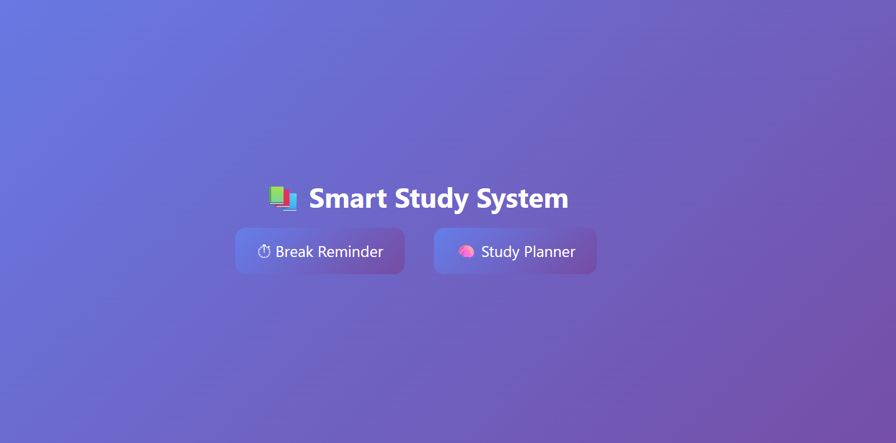
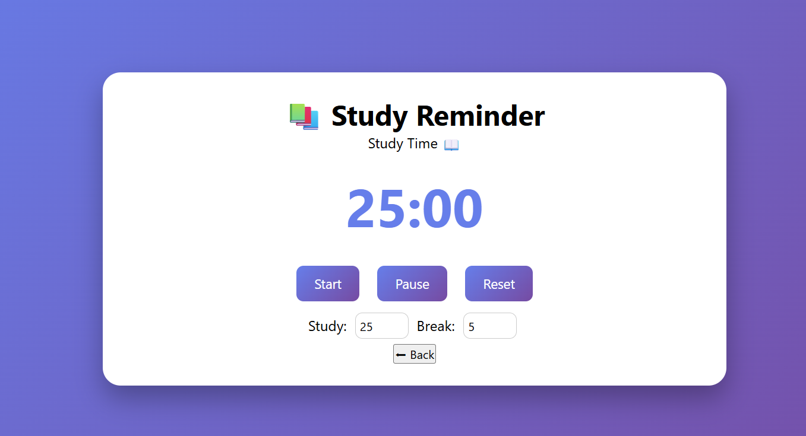
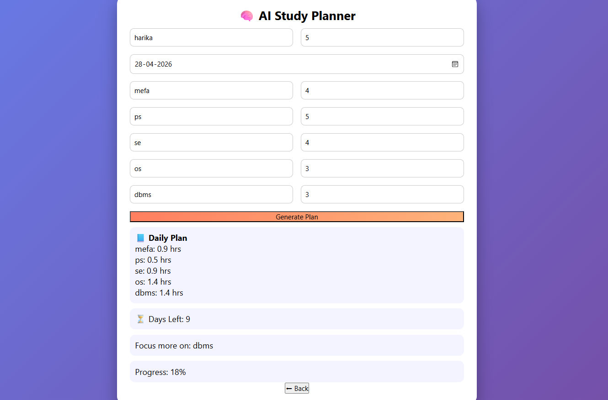
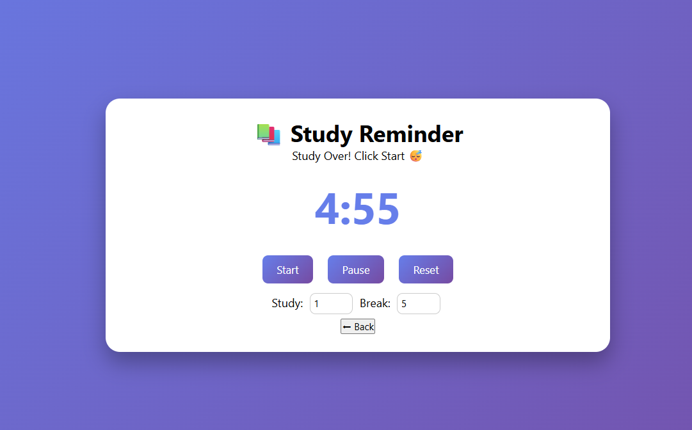

# Study Smart Planner ⏳

This project helps students stay productive by generating personalized study timetables and sending study & break reminders. 🚀

## ✨ Features

 Personalized timetable generation
 Study and break reminders
 Better productivity & time management
 Simple and user-friendly interface

## ⚙️ Technologies Used

* HTML
* CSS
* JavaScript

## 🧠 How it Works

The user enters study preferences, subjects, and timings, and the system automatically creates a balanced study schedule with reminders for study sessions and breaks. It follows the pomodoro technique for timer ad also provides manual changing of study and break timings. A beep sound will be produced after time ends.

## 📸 Output
The following screenshots showcase the working of the Study Smart Planner, including timetable generation and reminder features. 🚀

## 👩‍💻 Author

**Harika** 
